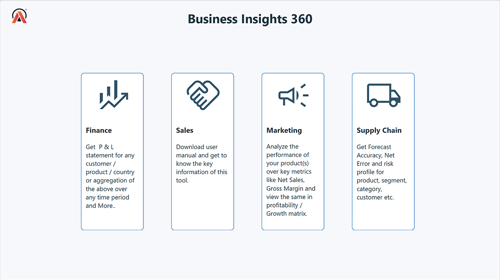
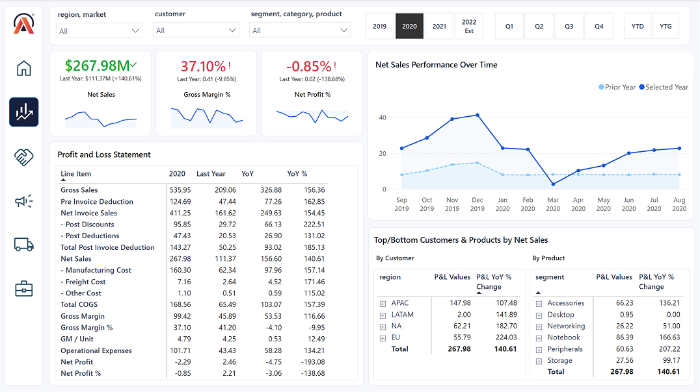
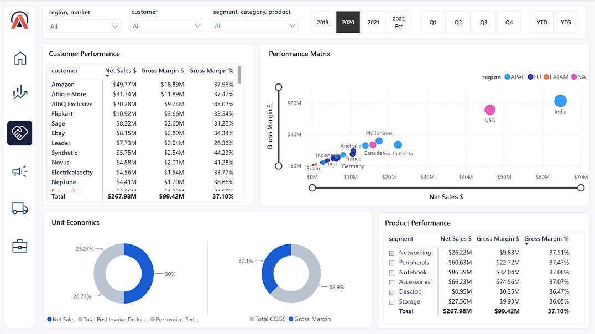
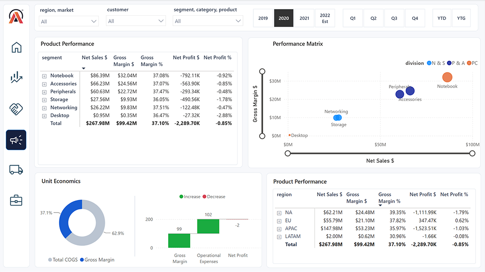
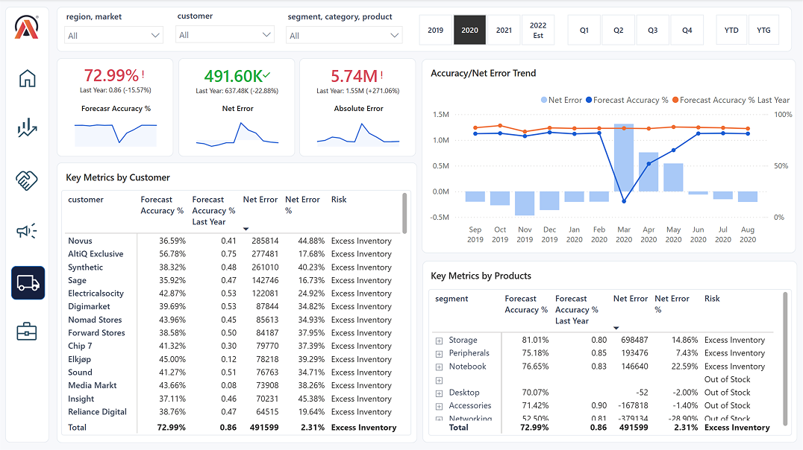

# Business Insights 360 — Power BI

## Overview

Business Insights 360 is an interactive Power BI report designed to provide a comprehensive view of business performance across finance, sales, marketing, and supply chain operations.

The report combines financial, customer, product, and forecasting metrics into dedicated analytical views, with interactive filters for year, quarter, region, market, customer, segment, category, and product.

## Dashboard



## Power BI File

The full interactive Power BI report is available as a `.pbix` file through GitHub Releases.

**[Download `business_insights_360.pbix`](RELEASE-LINK)**

The file is hosted as a GitHub release asset because its size exceeds GitHub's standard repository file-size limit.

## Report Views

### Finance

The Finance view provides a detailed Profit & Loss analysis with key financial KPIs, year-over-year comparisons, monthly performance trends, and customer and product breakdowns.



### Sales

The Sales view analyzes customer and product performance using Net Sales, Gross Margin, and Gross Margin %. A performance matrix helps compare sales and profitability across markets.



### Marketing

The Marketing view evaluates product and regional performance using Net Sales, Gross Margin, Net Profit, and profitability metrics.



### Supply Chain

The Supply Chain view focuses on forecasting performance and inventory risk using Forecast Accuracy, Net Error, Absolute Error, and customer- and product-level risk analysis.



## Key Metrics

The report tracks metrics including:

- Net Sales
- Gross Margin
- Gross Margin %
- Net Profit
- Net Profit %
- Forecast Accuracy %
- Net Error
- Absolute Error
- Year-over-Year performance

## Power BI Techniques Used

- Data modeling and table relationships
- DAX measures and calculated metrics
- Time intelligence and year-over-year analysis
- Dynamic filtering and slicers
- KPI cards
- Matrix and table visuals
- Conditional formatting
- Drill-down hierarchies
- Interactive report navigation
- Performance and profitability analysis
- Forecast accuracy and inventory risk analysis

## Tools

**Microsoft Power BI**

## Project Structure

```text
business-insights-360-power-bi/
│
├── README.md
│
└── images/
    ├── home.png
    ├── finance-view.png
    ├── sales-view.png
    ├── marketing-view.png
    └── supply-chain-view.png
```
